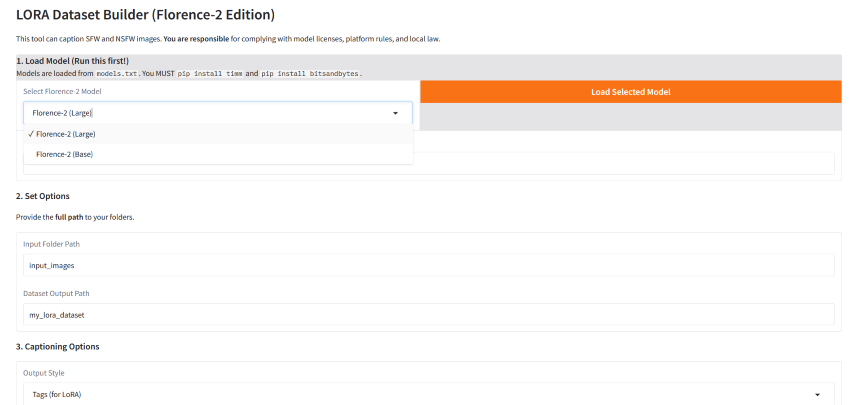
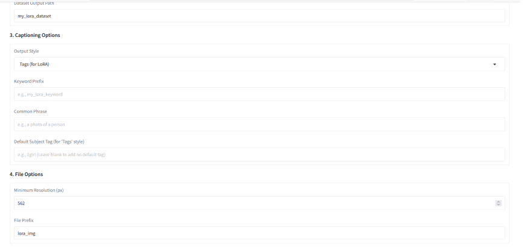
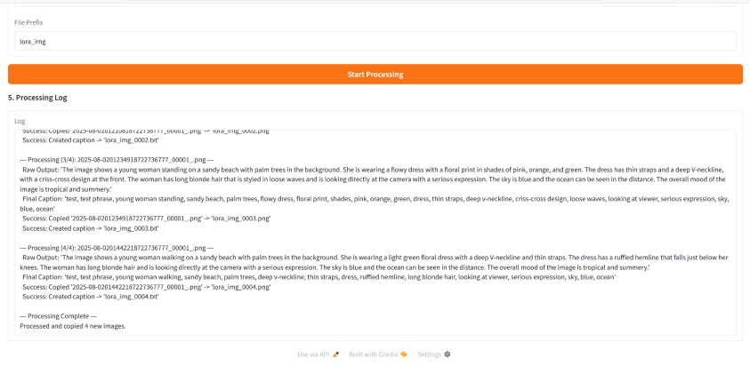

# Lora-Captioner

A small, focused tool to turn folders of images into **LoRA-ready datasets** using Microsoft’s Florence-2 vision-language models.

- Auto-captions images with Florence-2 (Large/Base)
- Converts detailed natural captions into **clean LoRA-style tags** or **natural sentences**
- Renames and copies images + `.txt` pairs into a training dataset folder
- Designed for Stable Diffusion / LoRA workflows

---

## Features

- **Florence-2 powered captions**
  - Uses Hugging Face models like:
    - `microsoft/Florence-2-large`
    - `microsoft/Florence-2-base`
  - Models are configured to run in **4-bit** with `bitsandbytes` where possible (GPU recommended).

- **Two caption styles**
  - `Tags (for LoRA)`  
    Aggressive cleanup into short, comma-separated tags suitable for LoRA training.
  - `Natural Sentence`  
    Lightly cleaned descriptive sentences for more general use.

- **LoRA-friendly tag cleaning**
  - Strips junk like:
    - `for`, `it appears`, `behind her`, `inviting atmosphere`, etc.
  - Normalizes common patterns:
    - `looking directly` → `looking at viewer`
    - `slight smile` + `smiling` → `smiling`
  - Handles NSFW phrases:
    - `breasts exposed` → `topless`
    - `completely naked` / `appears to be naked` → `nude`
  - Optional **default subject tag** (e.g. `1girl`) added if no subject-like tag exists.

- **Dataset builder workflow**
  - Renames images using a configurable prefix (e.g. `lora_img_0001.png`)
  - Creates a matching `.txt` caption file beside each image
  - Warns on images below a minimum resolution (configurable)

- **Local-first model cache**
  - Downloads and caches models under `models_cache/`
  - Hugging Face cache paths are set via:
    - `HUGGINGFACE_HUB_CACHE`
    - `HF_HOME`

- **Two entry points**
  - `app.py` — main **Gradio UI** using Florence-2
  - `lora_dataset_builder.py` — simple **CLI example** using BLIP

---

## Screenshots / UI Preview

## Example Output
Input

    Image: a woman on a tropical beach in a white floral dress

    Raw Florence caption (example):

    "The image shows a young woman walking on a tropical beach. She is wearing a white dress with a floral print and has long brown hair that is blowing in the wind. The dress has a deep V-neckline and thin straps that tie around her neck..."

Style 1: Tags (for LoRA)

Final caption might look like:

my_lora_keyword, beach set,
young woman walking, tropical beach, white dress, floral print,
deep v-neckline, thin straps, blowing, sand, skirt,
serious expression, looking at viewer, ocean, palm trees, sky, blue

Short, dense, and LoRA-friendly.
Style 2: Natural Sentence

Final caption might look like:

Young woman walking on a tropical beach in a white floral dress with a deep v-neckline and thin straps, long hair blowing in the wind, ocean and palm trees in the background.

More readable for general captioning, documentation, or metadata.
## Performance Notes / Benchmarks

Actual performance will vary by hardware, but some general expectations:

    GPU recommended

        Florence-2 is a fairly large model; running it with 4-bit quantization and device_map="auto" is strongly recommended.

        A mid-range GPU (e.g. RTX 3060) should be able to caption typical 512–1024px images at a comfortable pace.

    VRAM usage

        Florence-2 Large in 4-bit will still use several GB of VRAM.

        If you run into out-of-memory issues:

            Try the Florence-2 Base model.

            Close other GPU-heavy apps while processing.

    CPU fallback

        This project is primarily designed for GPU use. CPU-only may work but will be much slower.

        If you plan to run on CPU only, expect longer processing times and consider using the BLIP-based CLI script for lighter workloads.

## FAQ
Does this work offline?

Yes, after the first run.

    On first use, models are downloaded from Hugging Face and cached into models_cache/.

    After that, you can reuse the cached models without network access.

Can this handle NSFW images?

Technically, yes — it will:

    Normalize NSFW descriptors into tags like topless or nude for LoRA style,

    Or keep them as part of natural descriptions in sentence mode.

You are responsible for ensuring:

    You own or are allowed to use the images,

    You comply with model licenses and platform / local laws regarding NSFW content.

Why do the tags look “weirdly short”?

The Tags (for LoRA) mode is deliberately aggressive:

    It removes meta language and filler phrases like:

        the image shows, it appears, in the background, etc.

    It tries to keep only:

        subject, pose, clothing, location, key details

This is intentional to produce compact, SD-style tags rather than full sentences.
Can I change how tags are cleaned?

Yes. The core logic lives in:

    clean_lora_tags()

    post_process_tags()

You can modify:

    Which phrases are treated as junk

    How synonyms are merged

    Whether you want to keep longer phrases, etc.

Does it only work with Florence-2?

The Gradio app (app.py) is built around the Florence-2 interface. However:

    The model mapping is read from models.txt

    In principle, any model that:

        Works with AutoProcessor / AutoModelForCausalLM

        Supports the same image + text interface and post_process_generation
        could be added there.

For a simpler example using BLIP, see lora_dataset_builder.py.
## Troubleshooting
bitsandbytes / CUDA errors

Common issues:

    RuntimeError: CUDA error: ...

    bitsandbytes complaining about no GPU

Check:

    You have a working CUDA-capable GPU.

    You installed the correct PyTorch build for your CUDA version.

    bitsandbytes is installed and compatible.

If you continue to have issues, you can try:

    Switching to CPU (slower) by editing the model loading logic to remove the 4-bit config and device_map="auto".

    Using a smaller model (e.g. Florence-2 Base).

Hugging Face download issues

If model downloads fail:

    Make sure you have an internet connection on first run.

    Check that you can access the model pages on Hugging Face.

    Confirm that models_cache/ is writable.

## Model Comparison

By default, models.txt might look like:

Florence-2 (Large),microsoft/Florence-2-large
Florence-2 (Base),microsoft/Florence-2-base

You can adjust this file to:

    Add or remove entries

    Point to different Florence variants or your own fine-tuned models

In general:

    Florence-2 Large

        Better detail, richer captions

        More VRAM and compute needed

    Florence-2 Base

        Lighter and faster

        Still good quality for many datasets

You can test both and see which works best for your GPU and desired caption detail.
File Overview
app.py

## Main Gradio application:

    Loads a Florence-2 model from a dropdown (models.txt driven)

    Provides UI for:

        Input folder path

        Output dataset path

        Caption style

        Keyword prefix, common phrase, default subject tag

        Minimum resolution, file prefix

    Displays a scrolling log of:

        Raw descriptions

        Final tags / sentences

        Copy + .txt creation messages

models.txt

Plain text mapping of UI names → Hugging Face model IDs, one per line:

Friendly Name,model/identifier

Edit this file to customize which models show up in the dropdown.
lora_dataset_builder.py

Simpler, CLI-based example:

    Uses BLIP (Salesforce/blip-image-captioning-base) instead of Florence-2

    Configurable constants at the top:

        INPUT_FOLDER

        DATASET_FOLDER

        MIN_RESOLUTION

        FILE_PREFIX

    Outputs images and .txt caption files similar to the Gradio app, but without advanced tag cleaning.

requirements.txt

Python dependencies for this project, including:

    torch

    transformers

    gradio

    bitsandbytes

    timm

    Pillow

    and related packages.

## Install with:

pip install -r requirements.txt

run_app.bat (Windows helper)

Simple helper script (Windows only) that:

    Activates your environment (if you configure it to)

    Runs python app.py

You can double-click it to launch the Gradio app without using a terminal every time.
Installation

    Create a virtual environment (recommended):

python -m venv .venv

    Windows:

.venv\Scripts\activate

Linux/macOS:

    source .venv/bin/activate

Install dependencies:

pip install -r requirements.txt

(Optional but recommended) Verify PyTorch + CUDA:

    python -c "import torch; print(torch.cuda.is_available())"

    Should print True if your GPU is available.

## Usage (Gradio App – Florence-2)

    Prepare folders

        Put your source images in a folder, e.g.:

input_images/

Decide on an output folder, e.g.:

    my_lora_dataset/

Start the app

python app.py

This will launch a local Gradio server and display a URL in your terminal (typically http://127.0.0.1:8123 or similar).

In the browser UI

    Load model

        Select a model from the dropdown (e.g. Florence-2 (Large))

        Click Load Selected Model

        Wait until the status box shows success

    Set captioning options

        Input Folder Path → full path to your image folder

        Dataset Output Path → full path for your dataset

        Output Style → Tags (for LoRA) or Natural Sentence

        Keyword Prefix → optional (e.g. my_lora_keyword)

        Common Phrase → optional (e.g. summer beach set)

        Default Subject Tag → optional (e.g. 1girl)

    Set file options

        Minimum Resolution (px) → images smaller than this trigger a warning

        File Prefix → e.g. lora_img

    Start

        Click Start Processing

        Watch the log for progress and any warnings

Result

Your output folder will contain pairs like:

    lora_img_0001.png
    lora_img_0001.txt
    lora_img_0002.png
    lora_img_0002.txt
    ...

    Ready to be dropped into your LoRA training pipeline.

## Usage (CLI Example – BLIP)

If you prefer a simple command-line script:

    Edit lora_dataset_builder.py to match your paths:

INPUT_FOLDER = "input_images"
DATASET_FOLDER = "my_lora_dataset"
MIN_RESOLUTION = 562
FILE_PREFIX = "lora_img"

Run:

    python lora_dataset_builder.py

    It will:

        Caption each image using BLIP

        Save .txt files alongside renamed images in DATASET_FOLDER

This is a lighter-weight option if you don’t need Florence-2 or the Gradio UI.
License

## This project is licensed under the MIT License.

You are free to use, modify, and distribute it, subject to the terms of the MIT license.
Remember that the underlying models (e.g., Florence-2, BLIP) are subject to their own licenses on Hugging Face — please review and comply with those as well.